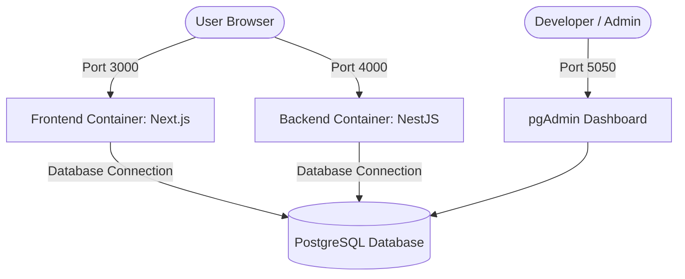

# DevOps & Deployment Guide (คู่มือ DevOps และการติดตั้งระบบ)

This document details the DevOps design, containerization architecture, and deployment procedures for the **TIF AssetFlow** application.

---

## Architecture Overview (ภาพรวมสถาปัตยกรรม)

The application is containerized using **Docker** and orchestrated locally with **Docker Compose**. The architecture comprises four main services:



1. **Frontend**: Next.js 16+ application running in an optimized `standalone` build mode on port `3000`.
2. **Backend**: NestJS application running on port `4000`.
3. **Database**: PostgreSQL 15-alpine server running on port `5432`.
4. **pgAdmin**: Database management web UI running on port `5050`.

---

## 🚀 Local Deployment with Docker Compose (การรันระบบภายในเครื่อง)

### Prerequisites (สิ่งที่ต้องเตรียม)
- [Docker Desktop](https://www.docker.com/products/docker-desktop/) installed and running.
- Git.

### 1. Configure Environment Variables (การตั้งค่า Environment)
Clone the `.env.example` at the root of the project to `.env`:
```bash
cp .env.example .env
```
Fill in the required values, specifically the **Cloudinary credentials** for file uploads:
```ini
CLOUDINARY_CLOUD_NAME=your_cloudinary_cloud_name
CLOUDINARY_API_KEY=your_cloudinary_api_key
CLOUDINARY_API_SECRET=your_cloudinary_api_secret
```

### 2. Start the Application (เริ่มต้นรันระบบ)
Run the following command to build and launch all containers:
```bash
docker compose up -d --build
```

### 3. Apply Migrations & Seed Data (การสร้าง Table และข้อมูลเริ่มต้น)
The system automatically applies migrations (`npx prisma migrate deploy`) during the backend startup. 

To seed the initial data (users, employees, and default assets), run the seed command inside the backend container:
```bash
docker compose exec backend npx prisma db seed
```
> [!WARNING]
> The default seed script cleans the database before insertion. Run it only during initialization or when you want to reset the environment.

### 4. Verify Services (ตรวจสอบการทำงาน)
- **Frontend App**: [http://localhost:3000](http://localhost:3000)
- **Backend API**: [http://localhost:4000](http://localhost:4000)
- **pgAdmin (DB Manager)**: [http://localhost:5050](http://localhost:5050)
  - *Login Email:* `pgadmin@assetflow.local`
  - *Login Password:* `pgadmin_password`

---

## 🛠️ Production Deployment Guide (คู่มือการนำขึ้นระบบจริง)

### Recommended Hosting Services
- **Database**: Managed databases like Neon (Serverless Postgres), AWS RDS, Supabase, or Railway.
- **Backend (NestJS)**: Render, Railway, AWS ECS, or DigitalOcean App Platform.
- **Frontend (Next.js)**: Vercel (recommended), Netlify, or self-hosted via Docker.

### 🛡️ Production Security Checklist
1. **Disable Seeding on Startup**: Do not call `prisma db seed` on backend container startup in production.
2. **Secrets Management**: Replace all secrets (`JWT_SECRET`, `CLOUDINARY_API_SECRET`, `POSTGRES_PASSWORD`) with secure, randomly generated strings.
3. **CORS Configuration**: Configure `FRONTEND_URL` in the NestJS backend environment variables to match your production domain.
4. **Database SSL**: Ensure `sslmode=require` is present in the `DATABASE_URL` query string.

---

## ⛓️ CI/CD Pipeline (ระบบ CI/CD)

A GitHub Actions workflow is configured at [.github/workflows/ci-cd.yml](file:///d:/All-Project/TIF%20AssetFlow/.github/workflows/ci-cd.yml) which triggers automatically on `push` or `pull_request` to the `main` branch.

It validates the following:
- Installs dependencies cleanly (`npm ci`).
- Validates the Prisma schema configurations.
- Compiles the NestJS typescript code.
- Builds the Next.js frontend production bundle.
- Runs backend unit tests (`npm run test`).
